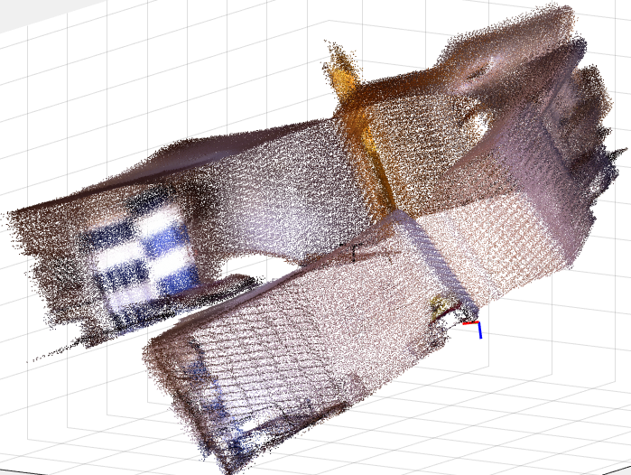

# 3D-Reconstruction-with-Iterative-Closest-Point

## Overview
The C++ libfreenect library was used to sample depth images from an XBox Kinect. 3D point clouds
(PC) were generated by applying pinhole camera projection to the depth images. PCs were colored by
co-registered camera pixels. A sequence of PCs were sampled as the Kinect was rotated 360
deg within a room. The built in Matlab Iterative Closest Point (ICP) algorithm stitched these PCs into a
globally consistent reconstruction of the room. This algorithm was based on The MS Kinect Fusion paper

### Prerequisites

This software was developed on Matlab 2016, and requires the *Computer Vision* for point cloud registration.

### Installing
No additonal installation procedures are required.

## Running the tests

Open Matlab. 
Navigate the *Current Folder* pane to the root directory of this repository. 
Run 'PointCloudICPRegistration.m'.
This entry point function will begin parsing the input depthData.bin and rgbData.avi under ./InputData.

### Example Output

1. [**Video of Texture Mapped Point Clouds**](https://www.youtube.com/watch?v=lRHfnbt3Jrc&list=PL9IYlUueNFobHMxW0egfu8OtYBQvWQMW9)
2. [**Video of 3D Reconstruction**](https://www.youtube.com/watch?v=298i8syG_b0&list=PL9IYlUueNFobHMxW0egfu8OtYBQvWQMW9&index=2) (i.e. regular PC-loadings)

## References
Newcombe R, Izade S, Hilliges O, et al. (2005). [*KinectFusion: Real-Time Dense Surface Mapping and Tracking*](https://www.microsoft.com/en-us/research/wp-content/uploads/2016/02/ismar2011.pdf), Microsoft Research Center.

## License

This project is licensed under the MIT License - see the [LICENSE.md](LICENSE.md) file for details

